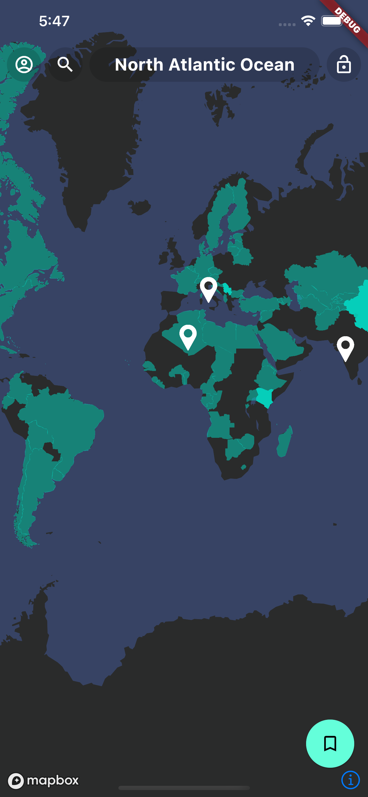
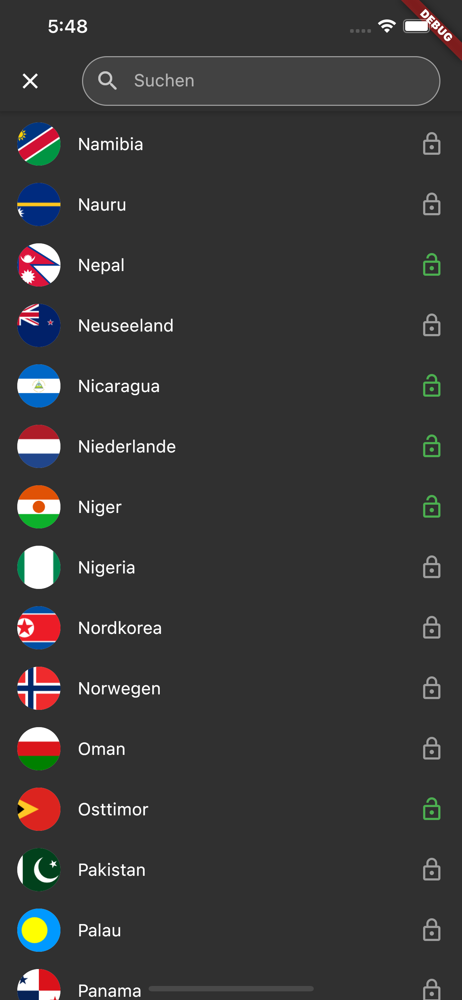
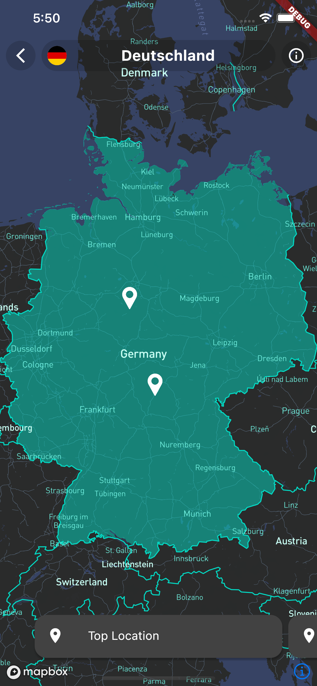
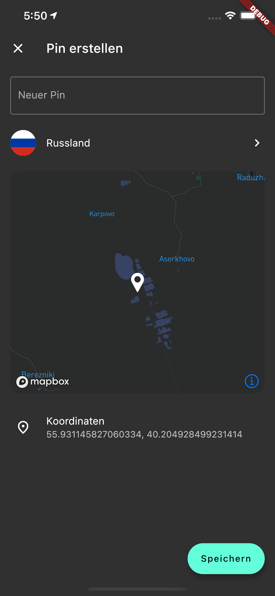
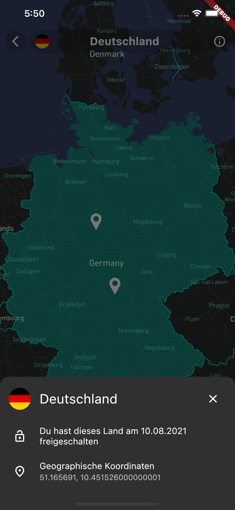

  

# Abstract

The goal of this project was to create a cross platform app for Android and IOS by using Google's UI toolkit Flutter. With the app a frequent traveler has the possibility to track his favourite places as well as the countries that have been visited. The App is using the fully managend Backend from Google which is known by the name Firebase in order to save the different locations and countries and authenticate the users.

# Getting Started

In order to start the application you need to install either the provided APK or the Appbundle which can be found in the release section. In addition to this option, futter can also be installed locally in order to start the app in debug or release mode. For the latter, Flutter offers a clear documentation to install all required apphaencies under the following link: [https://flutter.dev/docs/get-started/install](https://flutter.dev/docs/get-started/install). After the successful installation the app can be started by executing the `flutter run` command. Initially however you need to run `flutter pub get` inside the root folder of the cloned repository in order to download the required packages for the app.

# Screenshots

  
  
  
  
  
  

