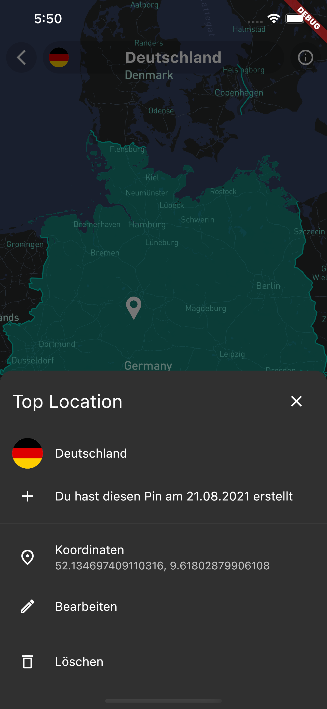

  

# Table of contents

- [Requirements](#Requirements)
- [Getting Started](#Getting-Started)
- [Project Structure](#Project-Structure)

# Abstract

The goal of this project was to create a cross platform app for Android and IOS by using Google's UI toolkit Flutter. A user

# Getting Started

## Prerequirements

## Prerequirements

# Project Structure

# Screenshots

  
  
  
  
  
  

